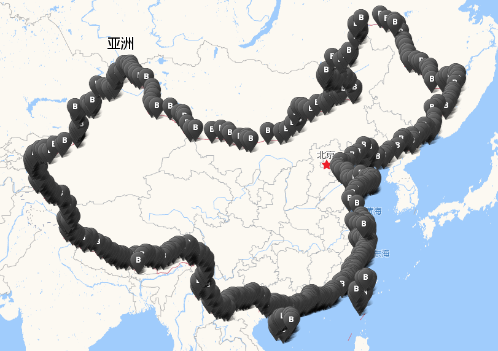

# 地球坐标系 (WGS-84)到火星坐标系 (GCJ-02) Javascript版 #

## 前言

此版本相对之前的release做了部分重构，主要调整的内容有：

    1. 优化边界判断算法，使用网上公开的中国边界坐标数据作为地图的不规则图形描边，并判断当前坐标是否落在多边形区域内
    2. 使用webpack4作为打包工具
    3. 使用eslint审查代码

## 查看示例

若已经安装了nodejs，可以在命令行下切换到项目目录执行

    npm start

然后访问：[http://127.0.0.1:3000/demo](http://127.0.0.1:3000/demo)，允许浏览器定位，查看纠偏效果。

若未安装nodejs，可以直接到demo目录下用浏览器打开index.html文件，查看默认设置的坐标纠偏效果。

## 快速开始

引入脚本

    

调用代码（参数分别为经度和纬度）;

    var gcjloc = transformFromWGSToGCJ(119.3122312,26.0240049);

返回GCJ-02坐标对象

    {lng: 119.31705425869873, lat: 26.02096344048847}

可通过npm install下载作为node模块引入

    npm install wgs2mars --save-dev

然后在项目中引入
    
    var transform = require('wgs2mars');
    var gcjloc = transform(119.3122312,26.0240049);// 返回{lng: 119.31705425869873, lat: 26.02096344048847}

## 致谢

感谢科普和其他语言版本开源作者的贡献！

### 坐标系科普：

[【高德地图API】如何解决坐标转换，坐标偏移？](http://segmentfault.com/blog/gaodelbs/1190000000498434 "【高德地图API】如何解决坐标转换，坐标偏移？")

### 该版本算法参考了以下几位的相关实现：

C#版：[地球坐标系 (WGS-84) 到火星坐标系 (GCJ-02) 的转换算法](http://blog.csdn.net/coolypf/article/details/8686588 "地球坐标系 (WGS-84) 到火星坐标系 (GCJ-02) 的转换算法")

C语言版：[ChinaMapShift](https://github.com/Dronaldo17/ChinaMapShift/blob/master/algorithm/china_shift.c "ChinaMapShift")

点在多边形内算法：[PNPOLY - Point Inclusion in Polygon Test](https://wrf.ecse.rpi.edu//Research/Short_Notes/pnpoly.html "PNPOLY - Point Inclusion in Polygon Test")

中国区域判断为粗略计算，算法中会排除台湾，香港什么的你懂的。如下图：

## 免责声明

该Javascript版本算法是基于网络上公开已知的其他语言算法实现的移植版本，作者不对其准确性和合法性做保证，**请在遵守国家保密法的前提下自行斟酌使用**。