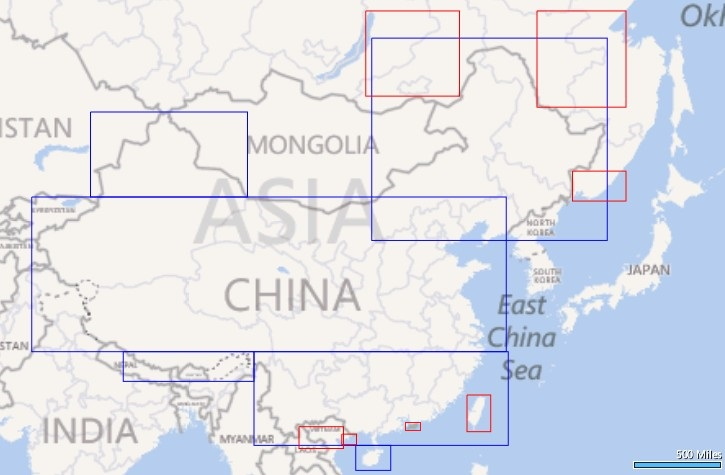

# 地球坐标系 (WGS-84)到火星坐标系 (GCJ-02) Javascript版 #

##背景
第一次开发跟地图相关的应用，一开始定位获得经纬度什么的还比较顺利，直到要在地图上显示出来的时候发现位置标记跟理想的不同，虽已提前了解也预料到，但本以为某某地图会提供相关的API实现，翻了一个晚上文档都没有看到，于是就只能自己动手寻找相关算法实现，貌似没有找到Javascript版本，于是有了该移植版本。

##查看示例

若已经安装了nodejs，可以在命令行下切换到项目目录执行

  npm start

然后访问：[http://127.0.0.1:3000/demo](http://127.0.0.1:3000/demo)

##快速开始

引入脚本

	

调用代码（参数分别为经度和纬度）;

	var gcjloc = transformFromWGSToGCJ(119.3122312,26.0240049);

返回GCJ-02坐标对象

	{lng: 119.31705425869873, lat: 26.02096344048847}

## 致谢

感谢科普和其他语言版本开源作者的贡献！

###坐标系科普：

[【高德地图API】如何解决坐标转换，坐标偏移？](http://segmentfault.com/blog/gaodelbs/1190000000498434 "【高德地图API】如何解决坐标转换，坐标偏移？")

###该版本算法参考了以下几位的相关实现：

C#版：[地球坐标系 (WGS-84) 到火星坐标系 (GCJ-02) 的转换算法](http://blog.csdn.net/coolypf/article/details/8686588 "地球坐标系 (WGS-84) 到火星坐标系 (GCJ-02) 的转换算法")

C语言版：[ChinaMapShift](https://github.com/Dronaldo17/ChinaMapShift/blob/master/algorithm/china_shift.c "ChinaMapShift")

中国区域判断优化：[http://www.cnblogs.com/Aimeast/archive/2012/08/09/2629614.html](http://www.cnblogs.com/Aimeast/archive/2012/08/09/2629614.html)

中国区域判断为粗略计算，蓝框表示中国区域，红框为排除区域，台湾什么的你懂的。如下图：

##免责声明

该Javascript版本算法是基于网络上公开已知的其他语言算法实现的移植版本，作者不对其准确性和合法性做保证，**请在遵守国家保密法的前提下自行斟酌使用**。